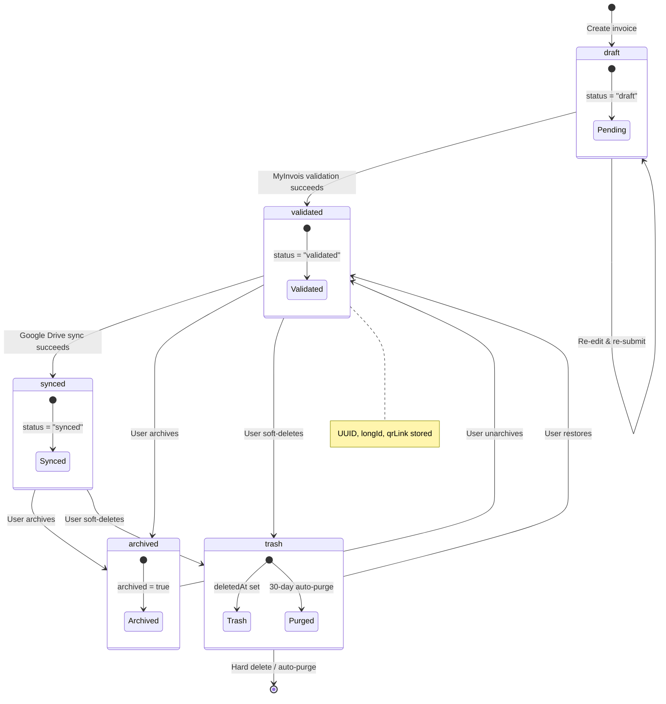
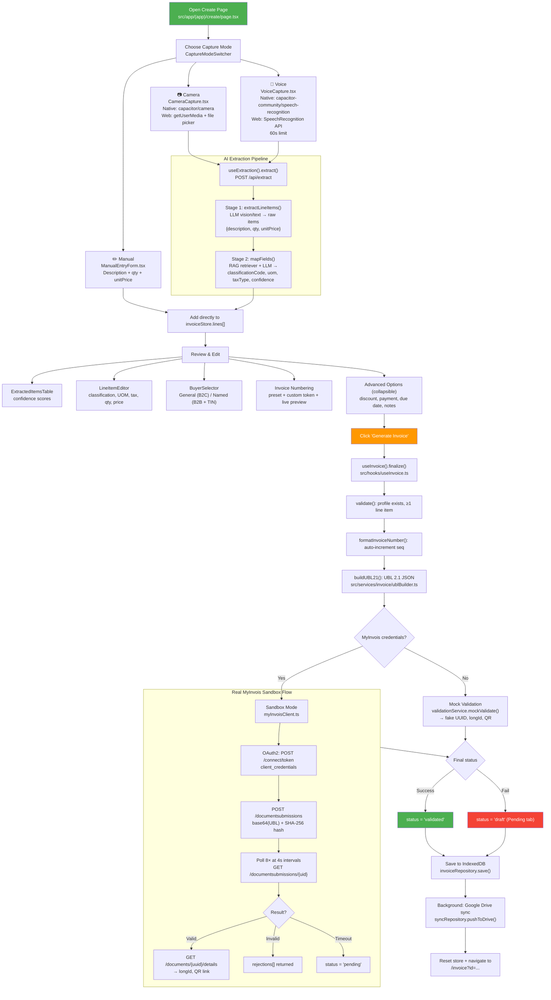
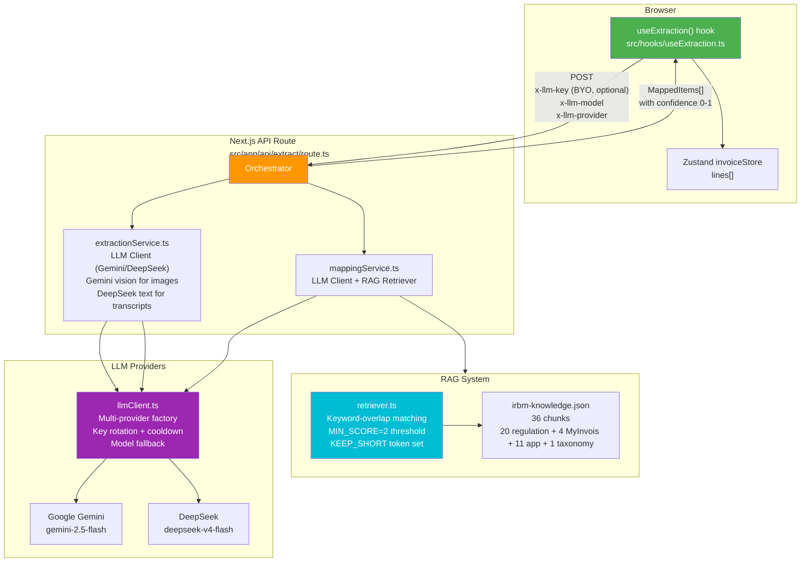
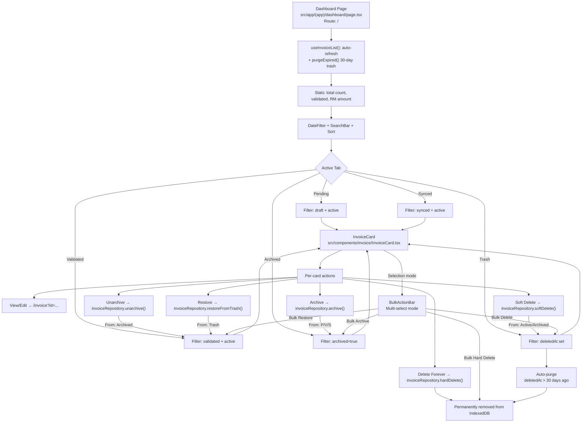
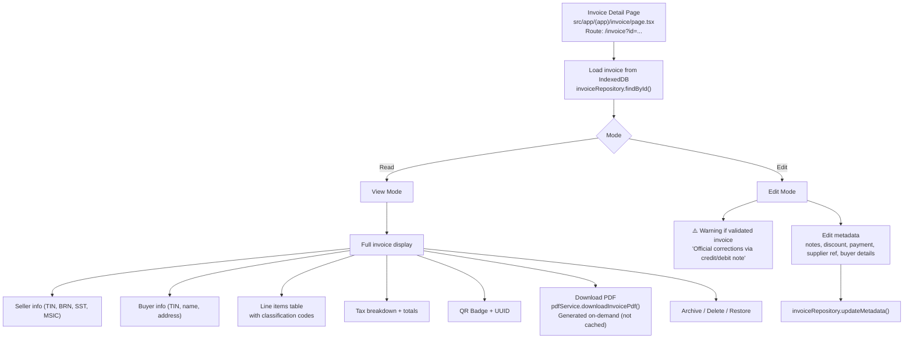
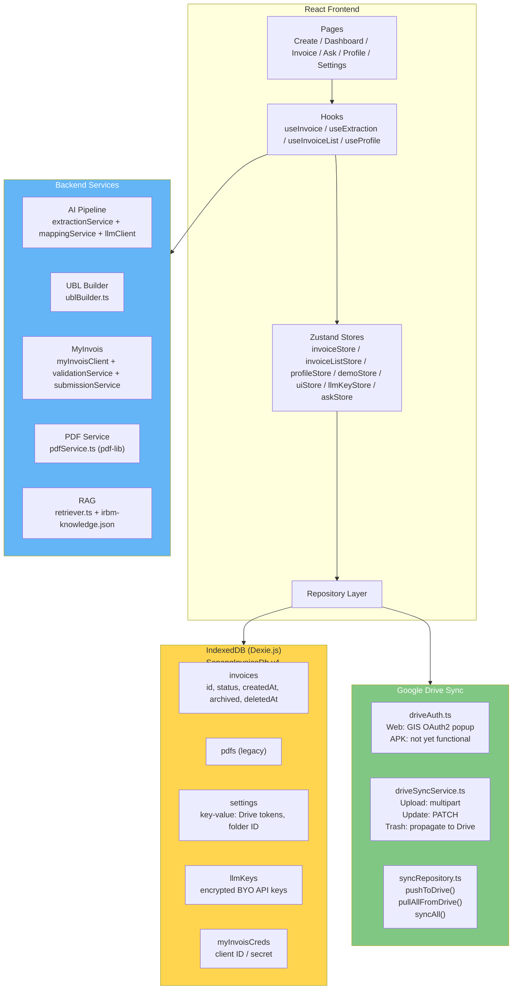

# Senang-Invoice Flow Diagrams

> Auto-generated 2026-06-21 from source code analysis.

---

## 1. Invoice Lifecycle State Machine



### State Definitions

| Field | Values | Purpose |
|-------|--------|---------|
| `status` | `draft` / `validated` / `synced` | Core lifecycle |
| `archived` | `boolean` | Manual archive flag |
| `deletedAt` | `string` (ISO) or `undefined` | Soft-delete timestamp |

### Tab → Filter Mapping

| Tab | Filter |
|-----|--------|
| Pending | `status === 'draft'` AND `!archived` AND `!deletedAt` |
| Validated | `status === 'validated'` AND `!archived` AND `!deletedAt` |
| Synced | `status === 'synced'` AND `!archived` AND `!deletedAt` |
| Archived | `archived === true` AND `!deletedAt` |
| Trash | `deletedAt` is truthy |

---

## 2. Full Invoice Creation Flow



---

## 3. AI Extraction Architecture



### LLM Key Flow

```
User BYO key (IndexedDB llmKeys table)
  ↓ sent as x-llm-key header
  ↓
/api/extract route
  ↓ tries user key first
  ↓ on 401/402/429 → falls back to server env SENANG_LLM_KEYS
  ↓
llmClient.failover()
  ↓ rotates through providers in priority order
  ↓ cooldowns rate-limited keys for 60s
  ↓
Returns result from first successful provider
```

---

## 4. Invoice History & Management Flow



### Card Display

```
┌─────────────────────────────────────────────────┐
│ INV-2024-0001                ┌────────┐         │
│ Kedai Kopi Senang             │ Validated│         │
│ 15 Dec 2024                   └────────┘         │
│ RM 1,250.00                        ☁️ Synced    │
│                                    [···] Actions │
└─────────────────────────────────────────────────┘
```

---

## 5. Invoice Detail View/Edit



---

## 6. Data Storage Architecture



### Repositories

| Repository | File | Operations |
|---|---|---|
| `invoiceRepository` | `src/services/data/invoiceRepository.ts` | CRUD, archive, soft/hard delete, restore, bulk ops, metadata updates |
| `profileRepository` | `src/services/data/profileRepository.ts` | Seller profile CRUD, numbering presets |
| `syncRepository` | `src/services/data/syncRepository.ts` | Drive push/pull, conflict detection, sync-all |
| `llmKeyRepository` | `src/services/data/llmKeyRepository.ts` | Encrypted LLM key storage |
| `myInvoisCredsRepository` | `src/services/data/myInvoisCredsRepository.ts` | MyInvois API credentials |
| `settingsRepository` | `src/services/data/settingsRepository.ts` | Key-value settings |
| `numberingPresetRepository` | `src/services/data/numberingPresetRepository.ts` | Numbering preset CRUD |

---

## 7. Component Tree & Routing

```mermaid
graph TD
    APP["AppShell<br/>min-h-dvh flex flex-col"] --> TOPBAR["TopBar (shrink-0)"]
    APP --> BANNER["DemoBanner (conditional, shrink-0)"]
    APP --> MAIN["&lt;main&gt; flex-1 overflow-y-auto<br/>max-w-2xl mx-auto px-4 py-4"]
    APP --> NAV["BottomNav (fixed bottom-0 z-40, lg:hidden)"]
    APP --> SNACK["Snackbar"]
    APP --> FAB["Fab (conditional)"]

    MAIN --> CREATE["/create — CreatePage"]
    MAIN --> DASH["/ — Dashboard"]
    MAIN --> INVOICE["/invoice?id=... — InvoiceDetail"]
    MAIN --> ASK["/ask — AskPage"]
    MAIN --> SETTINGS["/settings — SettingsPage"]
    MAIN --> PROFILE["/profile — ProfilePage"]

    CREATE --> TOOLBOX["Toolbox (shrink-0, border-t, shadow)<br/>▼ Add Items toggle | max-h 50vh"]
    CREATE --> ITEMS["ExtractedItemsTable"]
    CREATE --> EDITOR["LineItemEditor"]
    CREATE --> BUYER["BuyerSelector"]
    CREATE --> NUMBER["Invoice Numbering"]
    CREATE --> ADVANCED["Advanced (collapsible)"]
    CREATE --> GENERATE["Generate Button"]

    TOOLBOX --> CAMERA["CameraCapture"]
    TOOLBOX --> VOICE["VoiceCapture"]
    TOOLBOX --> MANUAL["ManualEntryForm"]

    DASH --> STATS["Stats Tiles"]
    DASH --> DATEFILTER["DateFilter (presets + range)"]
    DASH --> SEARCH["SearchBar + Sort"]
    DASH --> TABS["5 Tabs: Pending|Validated|Synced|Archived|Trash"]
    DASH --> CARDS["InvoiceCard[] list"]
    DASH --> BULKBAR["BulkActionBar"]

    NAV --> NAV_ASK["Ask"]
    NAV --> NAV_HOME["Home"]
    NAV --> NAV_FAB["➕ Create (FAB)"]
    NAV --> NAV_PROFILE["Profile"]
    NAV --> NAV_SETTINGS["Settings"]
```



---

## 8. Invoice Data Model

```typescript
Invoice {
  id: string                        // UUID or "demo-inv-*" for demo
  status: 'draft' | 'validated' | 'synced'
  archived: boolean
  deletedAt?: string                // ISO timestamp for soft-delete
  invoiceNumber: string
  issueDate: string
  dueDate?: string

  seller: {
    tin: string
    brn?: string
    sstRegNo?: string
    msicCode?: string
    name: string
    address: Address
    contact: { email, phone }
  }

  buyer: {
    type: 'general' | 'named'
    tin?: string                    // "EI00000000010" for general public
    name?: string
    address?: Address
  }

  lines: LineItem[] {
    description: string
    quantity: number
    unitPrice: number
    uom: string                     // UN/ECE Rec 20 (e.g., "C62" = one)
    taxType: '01' | '02' | '06' | 'E'
    taxAmount: number
    totalExcludingTax: number
    classificationCode?: string     // IRBM classification code
    confidence?: number             // 0-1 from AI extraction
  }

  totals: {
    totalExcludingTax: number
    taxTotals: { [taxType: string]: number }
    totalPayable: number
    discount?: { reason: string, amount: number }
  }

  payment?: {
    paymentMeansCode: string        // 01=cash, 02=cheque, etc.
    paymentTerms?: string
  }

  validation?: {
    uuid: string
    longId: string
    qrLink: string
    validatedAt: string
    status: 'mock' | 'valid' | 'invalid' | 'pending'
    submissionUid?: string
    rejections?: string[]
  }

  sync?: {
    driveFileId?: string
    driveSyncedAt?: string
    localModifiedAt?: string
  }

  notes?: string
  supplierRef?: string
  createdAt: string
  updatedAt: string
}
```

---

## 9. API Routes

| Method | Route | File | Purpose |
|--------|-------|------|---------|
| POST | `/api/submit` | `src/app/api/submit/route.ts` | Submit UBL to MyInvois (mock or sandbox) |
| POST | `/api/extract` | `src/app/api/extract/route.ts` | Extract items + map classification codes |
| POST | `/api/ask` | `src/app/api/ask/route.ts` | RAG-powered chat |
| POST | `/api/ocr` | `src/app/api/ocr/route.ts` | OCR endpoint |
| POST | `/api/llm/models` | `src/app/api/llm/models/route.ts` | List available LLM models |
| POST | `/api/contact` | `src/app/api/contact/route.ts` | Contact form |

---

## 10. Key Files Index

### Pages
- `src/app/(app)/create/page.tsx` — Invoice creation with capture, review, generate
- `src/app/(app)/dashboard/page.tsx` — History with 5 tabs, stats, search, sort, bulk
- `src/app/(app)/invoice/page.tsx` — Single invoice view/edit, PDF download, QR display
- `src/app/(app)/ask/page.tsx` — RAG chat with scope checker
- `src/app/(app)/profile/page.tsx` — Seller profile, numbering presets, MyInvois creds
- `src/app/(app)/settings/page.tsx` — LLM keys, language, demo mode

### Core Hooks
- `src/hooks/useInvoice.ts` — `finalize()`: UBL build + validation + save + sync
- `src/hooks/useExtraction.ts` — Calls `/api/extract`, adds items to store
- `src/hooks/useInvoiceList.ts` — Auto-refreshes dashboard list

### State Management
- `src/stores/invoiceStore.ts` — Create-page state: `lines[]`, `buyer`
- `src/stores/invoiceListStore.ts` — Dashboard state: `invoices[]`, refresh, remove
- `src/stores/profileStore.ts` — Current seller profile
- `src/stores/demoStore.ts` — Demo mode flag

### AI/Extraction
- `src/services/ai/extractionService.ts` — LLM item extraction from images/transcripts
- `src/services/ai/mappingService.ts` — Classification code + UOM mapping via RAG + LLM
- `src/services/ai/llmClient.ts` — Multi-provider LLM client with failover
- `src/services/rag/retriever.ts` — Keyword-overlap RAG retriever
- `src/data/irbm-knowledge.json` — 36 RAG knowledge chunks

### Invoice Services
- `src/services/invoice/ublBuilder.ts` — Builds UBL 2.1 JSON
- `src/services/invoice/validationService.ts` — Mock validation
- `src/services/invoice/submissionService.ts` — Routes mock vs sandbox
- `src/services/invoice/myInvoisClient.ts` — Real MyInvois sandbox API client
- `src/services/invoice/qrService.ts` — QR code PNG generation
- `src/services/invoice/pdfService.ts` — On-demand PDF generation (pdf-lib)

### Data Layer
- `src/services/data/db.ts` — IndexedDB schema (Dexie.js, SenangInvoiceDb v4)
- `src/services/data/invoiceRepository.ts` — Full invoice CRUD + lifecycle ops
- `src/services/data/syncRepository.ts` — Google Drive push/pull/sync

### Drive Sync
- `src/services/drive/driveAuth.ts` — Google OAuth (native + web)
- `src/services/drive/driveSyncService.ts` — Drive file CRUD

### Layout
- `src/components/layout/AppShell.tsx` — Root layout wrapper
- `src/components/layout/BottomNav.tsx` — 5-tab bottom nav
- `src/components/layout/DemoBanner.tsx` — Demo mode banner + auto-seed
```
